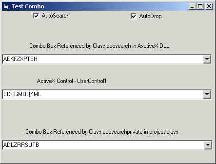



## Use Classes instead of activeX Controls\. Contains useful Combobox Lookup Example\(3 Variations\)

### Description

Use Classes instead of activeX Controls. Contains useful Custom Combobox Lookup Example to encapsulate GUI function. 

Advantages: 

Easy Code Maintainence.  

Easier to Create than active X Control 

No need to implement passthroughs for properties/methods/events(VB Does it AUTOMATICALLY - in a fashion) 

Instantly have events/properties code added to the class by VB 

Class can be public in activeX DLL and still perform all event related processing of a control on a form!!! 

Unlike ActiveX Controls - no extra resize event code needed to handle resizing 

Can ENCAPSULATE ALL Control Code within the class (including code for licenced controls) thus bypassing some of the licencing issues when distributing activeX controls holding other licenced controls eg for use on web pages 

Allows encapsulation of all Business Logic and GUI-control within easily maintainable classes (NEAT!)

THERE IS NO CODE IN THE TEST FORM THAT PERFORMS ANY OF THE ACTUAL METHODS/PROPERTIES/EVENTS USED IN THE LOOKUP/DROPDOWN FUNCTIONS. Dont Flame me for using the word objects in the context of VB.

Check it out
 
### More Info
 

Use Classes instead of activeX Controls. Contains useful Combobox Lookup Example. 

Advantages: 

Easy Code Maintainence. 

Easier to Create a class than an active X Control 

Dont have to implement passthroughs or events(VB Does it automatically in a fashion) 

Instantly have events/properties code added to the class by VB 

Dont have to handle resizing, as when using an activeX Control 

Add functionality to other activeX controls and avoid licencing issues (only a problem if you wanted to 'require a licence for your activeX' in ActiveX project options (and who doesnt).  

Can Simply add the class to a project rather than (1) reference an activeX DLL or (2) add an ActiveX component. 

 

 

 

Description: 

Code Reuse and Maintainence is of paramount importance. You can write code within a form to provide extra functionality to contained controls eg Combobox lookup function. However if you create another form you have to institute all the same code within that form(Yuck). 

 

One option is to create an activeX Control that contains the control and the code to handle the the extra function/s. Then you simply add that activeX control to any form. 

In creating the ActiveX Control you have to implement passthroughs for all the contained controls properties and methods eg Combobox.text, Combobox.list , Combobox.GotFocus etc. This is relatively easy with the help of the ActiveX Control Interface Wizard Addin, but is still a pain. 

 

An easy option is to create an activeX DLL containing a class that contains the following type declaration 'Private withevents mvarCBO as ComboBox'. That class can then reference a ComboBox on any form and perform the extra functionality without you having to implement passthroughs.(Neat). There are a few caveats. Firstly you will get an error if you try to set the mvarCBO variable to a control on a form - along the lines of  

eg. 

'In Class 

Public Property Let oCBOX(ByRef vData As ComboBox) 

Set mvaroCBO = vData 

End Property 

 

 

'Error message 

"Compile Error  

Private object models cannot be used in public object models as parameters or return types for public procedures, as public data members , or as fields of public user defined types." 

 

Dont be fooled by this cryptic message which in essence is telling you that you are unable to pass in the reference to the combobox. You can easily pass in a objptr reference (see code) and then obtain the object within the class. 

 

This method of implementing code compartmentalisation within a class to add funtionality to controls is something of a discovery for me and seems to be much quicker and easier to set up than activeX controls. Also it would be easy to set up a class to handle multiple controls. 

 

eg ComboBox1 and combobox2 with the class referencing both and handling lookup from Combobox1 and results displayed in combobox2. 

 

 

IMHO: 

 

Use this technique wherever possible for Control manipulation that requires a few properties and or methods of the control. 

 

eg Class to handle formating text within a Richtext box eg codehighlighting 

Class to handle printing from any RTF or TextBox 

Class to handle resizing a form and all contained controls 

Class to handle Flexgrid Editing 

Class to handle 3rd party ActiveX control EG VSFlexgrid 

Class to turn a Treeview Control onto an XML Editor(My current project) 

 

References 

See Bruce Mc Kinneys Book Hardcore visual basic for the details on pointer hacks 

(The book is in MSDN ONLINE, complete books.) 

             |
---                |---
**Submitted On**   |2001-01-27 21:35:10
**By**             |[Anton Knier](https://github.com/Planet-Source-Code/PSCIndex/blob/master/ByAuthor/anton-knier.md)
**Level**          |Intermediate
**User Rating**    |4.8 (19 globes from 4 users)
**Compatibility**  |VB 5\.0, VB 6\.0
**Category**       |[Coding Standards](https://github.com/Planet-Source-Code/PSCIndex/blob/master/ByCategory/coding-standards__1-43.md)
**World**          |[Visual Basic](https://github.com/Planet-Source-Code/PSCIndex/blob/master/ByWorld/visual-basic.md)
**Archive File**   |[CODE\_UPLOAD142181272001\.zip](https://github.com/Planet-Source-Code/anton-knier-use-classes-instead-of-activex-controls-contains-useful-combobox-lookup-exampl__1-14756/archive/master.zip)

